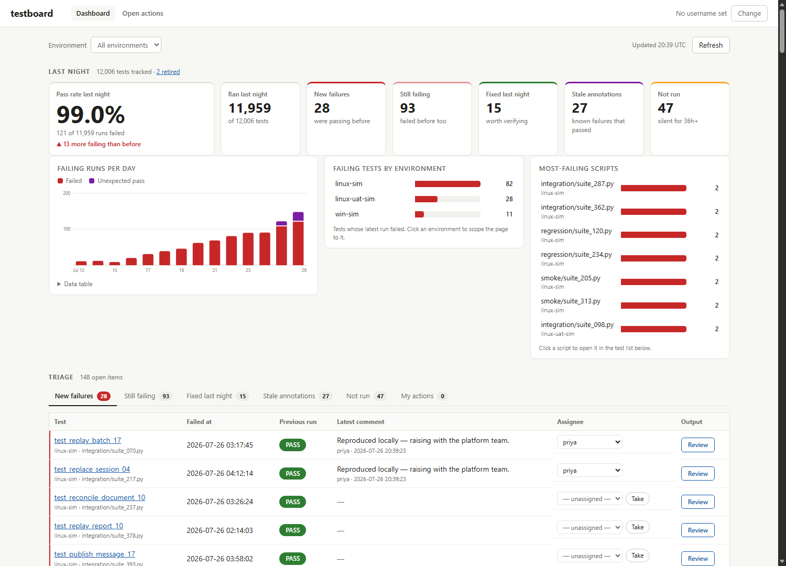

# testboard

A self-contained, open-source dashboard for overnight unit/regression test results.
It answers the questions triage engineers actually ask:

- **When did this test start failing?** (regression window: failing-since + last pass before it)
- **Is it flaky?** (transition-based flakiness score and classification)
- **Does it fail on a pattern?** (day-of-week failure profile — "always fails on Mondays")
- **Is it getting slower?** (min/median/max duration over the window)

testboard owns storage (SQLite), the HTTP API, analytics, and the web UI. Results are
pushed in by a small feeder script (also in this repo) from whatever test system you
run on site.

**Requires only Python 3.6+. No pip, no npm, no build step, no CDN, no internet access
at runtime.** Everything is Python standard library plus static HTML/JS/CSS served by
the same process.


*The home screen on a simulated 12,000-test estate — run the quick start below to get this locally.*

---

## Quick start

From a clean clone, one command gives you a browsable dashboard populated with 45 days
of simulated history (steady passers, a regression, a flaky test, a Monday-failer, a
known failure, a slowing test) plus real results from this repo's own test suite:

```
git clone <this repo>
cd TestDashboard
python tools/demo_bootstrap.py
```

Then open <http://127.0.0.1:8000>.

`demo_bootstrap.py` options: `--db` (default `testboard.db`), `--port` (default `8000`),
`--host`, `--days`, `--seed`, `--skip-self-tests`, `--no-serve`, and
`--scale-tests N` — seed N additional filler tests (mostly green, with a
realistic sprinkle of regressions, flaky tests, stale annotations and tests
gone silent) to preview the dashboard at production scale:

```
python tools/demo_bootstrap.py --scale-tests 12000
```

On RHEL/most Linux distributions the platform Python is invoked as `python3`:

```
python3 tools/demo_bootstrap.py
```

## Running the real server

```
python run_server.py [--host 127.0.0.1] [--port 8000] [--db testboard.db] [--static <repo>/static]
```

| Flag | Default | Meaning |
|---|---|---|
| `--host` | `127.0.0.1` | Bind address. Use `0.0.0.0` to serve your team. |
| `--port` | `8000` | TCP port. |
| `--db` | `testboard.db` | SQLite database file. Created and migrated automatically on startup. |
| `--static` | `static/` next to `run_server.py` | Directory of frontend files. |

The server prints its URL on startup and shuts down cleanly on Ctrl+C. The database
schema is versioned (`schema_version` table) and migrated automatically, so upgrading
testboard is just replacing the code and restarting.

---

## HTTP API reference

All endpoints live under `/api` and speak JSON (`application/json; charset=utf-8`).
Errors are always JSON of the shape `{"error": "message"}` — never HTML:

- `400` — validation failure (message names the offending field/value)
- `404` — unknown test/run/route
- `405` — wrong method (response carries an `Allow` header listing valid methods)

**URL encoding:** the test identity is the triple `(environment, script, test_name)`
and each appears as its own path segment. Segments must be percent-encoded by the
client; the server decodes each segment individually, so test names containing `/`
must be sent as `%2F`. `+` is **not** decoded to a space — use `%20`.

**Timestamps:** all times are UTC, ISO-8601, format `YYYY-MM-DDTHH:MM:SS.ffffff`,
with **no timezone suffix** (no `Z`, no `+00:00`). Values with a timezone suffix are
rejected.

### POST /api/import — bulk upsert of runs (the feeder contract)

Request body:

```json
{"runs": [RunRecord, ...]}
```

#### Transport schema for a RunRecord (shared with the feeder)

```json
{
  "environment": "linux-prod-sim",
  "script": "regression/user_lifecycle.py",
  "test_name": "test_partial_update_retry",
  "result": "FAIL",
  "start_time": "2026-07-25T02:14:07.123456",
  "end_time": "2026-07-25T02:14:09.001000",
  "output": "…full captured output…",
  "source_link": "https://git.example.com/tests/user_lifecycle.py#L120",
  "known_failure_reason": null
}
```

All times UTC, ISO-8601, no timezone suffix. `known_failure_reason` null unless the
test is annotated as a known failure. `output` may be empty but must be present.

Validation rules per record:

- `environment`, `script`, `test_name`: required strings, non-empty after stripping.
- `result`: required; one of `PASS`, `FAIL`, `FAILED_AS_EXPECTED`, `UNEXPECTED_PASS`.
- `start_time`, `end_time`: required, parseable ISO-8601 as above; `end_time` must be
  `>= start_time`.
- `output`: required key, must be a string (may be `""`).
- `source_link`: optional string, defaults to `""`.
- `known_failure_reason`: optional, string or null, defaults to null.
- Unknown extra keys are ignored (forward compatibility).

**Idempotency:** a run is uniquely keyed by
`(environment, script, test_name, start_time)`. Re-importing the same run updates it
in place — re-running an import is always safe and never duplicates data. A record
that is **byte-identical** to what is stored (all fields, output included) writes
nothing at all: feeders that re-push their whole recent window on a schedule cost
the server nothing but reads.

Response — `200` even when some records are rejected; one bad record never aborts the
batch (valid records are still upserted):

```json
{
  "inserted": 40,
  "updated": 2,
  "unchanged": 1,
  "rejected": 1,
  "errors": [
    {
      "index": 17,
      "error": "result: unknown value 'BROKE'",
      "environment": "linux-prod-sim",
      "script": "regression/foo.py",
      "test_name": "test_bar",
      "start_time": "2026-07-25T02:14:07.123456"
    }
  ]
}
```

Each error object carries the record's identity fields when they could be extracted
from the raw dict (null when absent), so you can grep your source data for the exact
offending run. `400` is returned only when the envelope itself is malformed (invalid
JSON, or `runs` missing / not a list).

`updated` counts every accepted record that already existed, **including** the
byte-identical ones — its meaning on the wire has not changed, so a feeder summing
`inserted + updated` still accounts for every accepted record. `unchanged`
(added 2026-07-31) refines it: the subset that required no write. A push whose
records are all `unchanged` is the healthy steady state for a scheduled re-push,
not a stall.

### GET /api/dashboard — latest run per test (paginated)

**This endpoint returns one page, never the whole estate.** With 12,000 tests a
night, serializing every row was a 4.6 MB response and several hundred
milliseconds of work; filtering, searching, sorting and paging are therefore all
done in SQL, and the response carries the exact total for the filters so a
caller knows what its page is a slice of.

Query parameters (all optional):

| Parameter | Meaning |
|---|---|
| `environment` | exact match |
| `script` | exact match |
| `result` | repeatable; invalid value → 400 |
| `q` | case-insensitive (ASCII) substring match on test name; `%`, `_` and `\` are literal |
| `stale` | `1`/`true` — only tests whose latest run is older than the 36 h recency window ("not run") |
| `retired` | `1`/`true` — include tests retired as no longer in the suite (hidden by default) |
| `assignee` | repeatable — only tests owned by these people |
| `unassigned` | `1`/`true` — include tests nobody owns (ORed with `assignee`) |
| `with_comment` | `1`/`true` — add `latest_comment` to each row (one index seek per returned row, so it is opt-in) |
| `sort` | one of `environment` (default), `script`, `test_name`, `result`, `start_time`, `duration`, `assignee`; anything else → 400 |
| `order` | `asc` (default) or `desc`; anything else → 400 |
| `limit` | 1..1000, default 250 |
| `offset` | ≥ 0, default 0 |

Response:

```json
{
  "tests": [
    {
      "environment": "...", "script": "...", "test_name": "...",
      "run_id": 7, "result": "FAIL",
      "start_time": "...", "end_time": "...", "duration_seconds": 1.234,
      "known_failure_reason": null, "source_link": "...", "assignee": null,
      "retired_at": null, "retired_by": null
    }
  ],
  "total": 12376, "limit": 250, "offset": 0
}
```

With `with_comment=1` each row also carries
`"latest_comment": {"author": "...", "created_at": "...", "text": "..."}`
(absent when the test has no comments).

`total` counts every test matching the filters, not the rows returned. Every
ordering ends with the full test identity, so paging with `limit`/`offset` can
neither repeat nor skip a row.

`output` is never included in list responses (it can be large — see
[Scale](#scale-and-retention)).

### GET /api/summary — the home-screen estate rollup

Everything the triage home screen needs in one request. Query parameters (all
optional): `environment` (exact match; scopes every number below), `days`
(integer 1..90, default 14; the trend window — invalid values → 400), `assignee`
(adds the `mine` queue for that user).

None of this is proportional to the size of the estate: the headline counts come
from a single `GROUP BY` (a few dozen rows however many tests exist), and each
queue is its own indexed query.

**`parts` slices the payload** so a page can paint progressively instead of
waiting for its slowest piece (this is what the home screen does):

- `parts=headline` — everything below EXCEPT `queues`: the counts, trend,
  rollups and filter lists, plus `queue_totals` (`{kind: exact_total}` for
  every queue including `mine`) so tab badges render before any rows arrive.
- `parts=queue&queue=<kind>` — one queue's rows:
  `{"generated_at", "environment", "stale_before", "queue_cap",
  "kind", "queue": {"total": n, "tests": [QueueEntry, ...]}}`.
  `kind` is a queue name below or `mine`.
- No `parts` — the full payload, headline plus every queue, as before the
  split (plus `queue_totals`). `tests/test_api.py::SummaryPartsTest` pins the
  parts to the whole, so the two cannot drift.

```json
{
  "generated_at": "2026-07-26T06:30:00.000000",
  "environment": null,
  "environments": ["linux-prod-sim", "linux-uat-sim"],
  "scripts": ["regression/user_lifecycle.py", "smoke/login.py"],
  "assignees": ["alice", "luke"],
  "recent_hours": 36,
  "queue_cap": 500,
  "status": {
    "total_tests": 12000, "ran_recently": 11840, "not_run": 160, "retired": 34,
    "results":        {"PASS": 11400, "FAIL": 420, "FAILED_AS_EXPECTED": 130, "UNEXPECTED_PASS": 50},
    "recent_results": {"PASS": 11280, "FAIL": 410, "FAILED_AS_EXPECTED": 110, "UNEXPECTED_PASS": 40},
    "new_failures": 35, "still_failing": 385, "fixed": 28, "assigned_open": 210
  },
  "trend": {"days": 14, "from": "2026-07-13", "to": "2026-07-26",
            "nights": [{"date": "2026-07-13", "PASS": 11500, "FAIL": 300,
                        "FAILED_AS_EXPECTED": 120, "UNEXPECTED_PASS": 30, "total": 11950}]},
  "by_environment": [{"environment": "linux-prod-sim", "total_tests": 8000, "failed": 300,
                      "new_failures": 25, "unexpected_passes": 35, "not_run": 90}],
  "top_failing_scripts": [{"environment": "linux-prod-sim",
                           "script": "regression/user_lifecycle.py", "failing": 40}],
  "queue_totals": {"new_failures": 35, "still_failing": 385, "unexpected_passes": 50,
                   "fixed": 28, "not_run": 160, "assigned": 210, "mine": 4},
  "queues": {
    "new_failures":      {"total": 35,  "tests": [QueueEntry, ...]},
    "still_failing":     {"total": 385, "tests": [...]},
    "unexpected_passes": {"total": 50,  "tests": [...]},
    "fixed":             {"total": 28,  "tests": [...]},
    "not_run":           {"total": 160, "tests": [...]},
    "assigned":          {"total": 210, "tests": [...]},
    "mine":              {"total": 4,   "tests": [...]}
  }
}
```

Definitions (matching the analytics semantics above):

- A test **ran recently** when its latest run started within `recent_hours`
  (36) of now — wide enough that a test misses a whole nightly batch before it
  counts as `not_run`, without flapping on the batch's own start hour.
- `results` counts every test by its latest run (the current state of the
  estate); `recent_results` counts only recently-run tests (the "last night"
  view).
- **New failure**: latest FAIL, previous run not FAIL (or first ever run).
  **Still failing**: latest and previous both FAIL. **Fixed**: previous FAIL,
  latest not. **Not run**: has not reported inside the recency window — this is
  the queue where a disappeared test is [retired](#put-apitestsenvscripttestretired--approve-a-disappeared-test).
  **Assigned** (open actions): has an assignee and the latest result is FAIL or
  UNEXPECTED_PASS. A test may appear in several queues.
- **Retired tests are in none of them**, and are excluded from every count
  except `status.retired`.
- `mine` is `assigned` narrowed to the `assignee` parameter, filtered in SQL —
  not a client-side filter of `assigned`, which would hide a user's own tests
  behind other people's once the estate has more open items than the cap.
  Without an `assignee` parameter it is `{"total": 0, "tests": []}`.
- `trend.nights` is zero-filled: every UTC calendar day in the window appears
  even when nothing ran. Its cost tracks the *width of the window*, not the
  size of the history behind it.
- `scripts` lists the distinct scripts in scope — it feeds the test-list filter,
  which can no longer derive them from a downloaded estate.
- Each queue reports its exact `total` but carries at most `queue_cap` (500)
  entries, selected by test identity; narrow with `environment` to see past it.
  A QueueEntry is a dashboard Row (minus `end_time`/`source_link`) plus
  `prev_result`, `failing_since` (start of the current FAIL streak) and
  `last_pass_time` (most recent PASS before that streak). The streak fields are
  populated only for the queues that report them — `still_failing` and `mine` —
  and are null elsewhere, including for every entry whose latest run is not a
  FAIL. Within the slice it returns, `still_failing` is ordered
  oldest-regression-first.

### GET /api/watch — the Watchlist page's data, one request per page load

`?c=` is repeated, one per card, in request order: `c=p:<product>` or
`c=e:<environment>`. Each comes back as `{spec, kind, name, ok, failing,
new_failures, fixed, unexpected_passes, stale_before, last_reported}`
(product cards carry `last_reported: null` — there is no single truthful
"last reported" for a card spanning several environments) or, for a name
that resolves to nothing, `{spec, kind, name, ok: false, error}`. The page
still answers 200 around a mix of good and bad cards.

**Cards per request are capped at 50.** A request naming more answers 413
with the count and the limit in the message; a URL that long is treated as
a mistake, not a use case. `c=s:...` (stream cards) 400s the WHOLE request
with a "streams arrive in a later drop" message — that kind is reserved by
the URL grammar so it never has to change, but nothing behind it exists yet.

### GET /api/scripts/{environment}/{script}/executions — suite history

The estate is keyed on individual tests, but people run and reason about whole
scripts. This returns the recent **executions** of one suite, newest first.

Query parameters: `days` (1..90, default 14).

```json
{
  "environment": "linux-prod-sim", "script": "regression/user_lifecycle.py",
  "days": 14, "gap_minutes": 60, "run_count": 450, "truncated": false,
  "executions": [
    {"started": "2026-07-26T14:30:00.000000",
     "ended": "2026-07-26T14:47:56.000000",
     "duration_seconds": 1076.0, "total": 30, "failed": 4,
     "results": {"PASS": 26, "FAIL": 4,
                 "FAILED_AS_EXPECTED": 0, "UNEXPECTED_PASS": 0}}
  ]
}
```

**Executions are inferred from timing**, because a run record carries no batch
identifier — the import contract is a flat list of runs. A new execution starts
when a run begins more than `gap_minutes` (60) after the latest END seen so far.
Measuring from the last *end* rather than the last *start* means one slow test
cannot split its own execution in two.

This is what the home screen's daily trend cannot show: a suite that runs twice
in a day is one bar there and two executions here.

### GET /api/tests/{environment}/{script}/{test_name} — test detail

`404` if the triple has no runs. Response:

```json
{
  "environment": "...", "script": "...", "test_name": "...",
  "source_link": "...",
  "assignee": "alice",
  "latest": {"run_id": 7, "result": "FAIL", "start_time": "...", "end_time": "...",
             "duration_seconds": 1.234, "known_failure_reason": null, "source_link": "..."},
  "analytics": { ...see Analytics below... }
}
```

### GET /api/tests/{environment}/{script}/{test_name}/history

Query: `limit` (integer 1..500, default 50), `before` (ISO timestamp; returns runs
with `start_time < before` — pass the oldest loaded `start_time` to page). Bad values
→ 400; unknown triple → 404. Response: `{"runs": [RunOut, ...]}` newest first, where
RunOut is the same shape as `latest` above (no `output`).

### GET /api/runs/{run_id}

The only endpoint that returns `output`. Non-integer or unknown id → 404. Response:
RunOut plus `{"environment", "script", "test_name", "output"}`.

### Known-failure reason

`known_failure_reason` is optional on every run and is never required — a run
without one imports exactly as before. When a run does carry one it is
**surfaced as a banner on the test page**, directly under the latest result, and
in the `Known failure reason` column of the run history. Whitespace-only values
are normalised to `null`.

It is the annotation that decides whether a failure needs looking at, so it is
worth sending: typically alongside `FAILED_AS_EXPECTED`, with a ticket id or a
sentence.

### Comments

Comments are per TEST (the triple), not per run, and can be added to any
test whatever its latest result — recording *why* a test only passes is as
useful as recording why it fails. The full thread is on the test page; the
newest comment is shown in the triage queues and the open-actions view.

- `GET /api/tests/{env}/{script}/{test}/comments` — 404 unknown triple. Response:
  `{"comments": [{"id": 1, "author": "alice", "created_at": "...", "text": "..."}]}`
  oldest first.
- `POST` same path — body `{"username": "...", "text": "..."}`. `username` non-empty,
  max 100 chars (stripped); `text` non-empty, max 10000 chars. The user is created
  implicitly if unknown. Returns `201` with `{"comment": {...}}`.

### PUT /api/tests/{env}/{script}/{test}/assignee

Body `{"username": "bob-or-null", "assigned_by": "alice"}`. The `"username"` key is
**required**; pass `null` to clear the assignment. `assigned_by` must be a non-empty
string. Both users are created implicitly if unknown. Assignment history is kept for
audit; the current assignee is the most recent entry. Returns `200`
`{"assignee": "bob"}` (or null).

### PUT /api/tests/{env}/{script}/{test}/retired — approve a disappeared test

A test that stops being reported shows up as "not run" forever. Retiring it is a
human approving that absence, so it takes a username **and** a reason:

```json
{"retired": true, "username": "luke", "comment": "Deleted in release 4.2."}
```

400 if `comment` is missing or blank, or `retired` is not a boolean.
Response: `{"retired": true, "retired_by": "luke", "comment": {...}}`.

- The reason is appended to the test's normal comment thread, so the next person
  to look finds it where they already look.
- A retired test disappears from the **estate views** — the headline counts, the
  triage queues, the default test list — and is counted in `status.retired`.
- Its **history is untouched**: the detail page, run history and comments all
  work exactly as before. Retirement means "not in the suite any more", not
  "never happened".
- If the test reports a run again it is **un-retired automatically**, with a
  comment recording why. Silently missing data is worse than an unexpected row.
- Send `{"retired": false, ...}` to put it back by hand.

### Users

- `GET /api/users` — `{"users": [{"username": "...", "created_at": "..."}]}` sorted by
  username.
- `POST /api/users` — body `{"username": "..."}` (non-empty, max 100, stripped).
  New user → `201`, existing → `200`; both return
  `{"user": {"username": "...", "created_at": "..."}, "created": <bool>}` where
  `created` is `true` only when the user was just created.

There is **no authentication** (see Non-goals): users self-identify by username,
stored client-side in `localStorage`.

### GET /api/site-notes — this site's own What's new notes

```json
{
  "notes": [
    {"id": 1, "date": "2026-07-30", "text": "Parser fixed.",
     "author": "luke", "added_at": "2026-07-30T09:12:00.000000"}
  ],
  "configured": true,
  "problem": null
}
```

Newest `date` first. `static/whatsnew.html` carries testboard's own release
notes and ships inside the build; these are the *site's* notes shown under the
same dates — a reader that was fixed, a box that was rebuilt — added with
[`tools/add_site_note.py`](#site-specific-whats-new-notes).

**This endpoint never fails.** A notes file that is absent, empty, unreadable
or malformed returns `notes: []` with `problem` set to a one-line reason, and
`configured: false` means no path was given at all. These annotate a page whose
real content already shipped in the build, so failing the request would take
the release notes down with the side-car. The frontend therefore has one shape
to handle rather than two.

The file is read **per request**, so a note added by the CLI is live without
restarting the server.

---

## Analytics definitions

Returned by the test-detail endpoint, computed server-side by pure, unit-tested
functions. Exact semantics:

- **Failure** means `result == FAIL` only. `FAILED_AS_EXPECTED` counts as non-failure
  (the failure is annotated and expected). `UNEXPECTED_PASS` is also non-failure but
  is tracked separately — it usually means a known-failure annotation is stale.
- **Window**: runs with `start_time >= now - max_days`, then the newest `max_runs` of
  those. Defaults: `max_days=90`, `max_runs=200` (i.e. last 90 days or last 200 runs,
  whichever is smaller).
- **Failure streak / regression window**: `failing_since` is the oldest run of the
  consecutive streak of `FAIL` runs ending at the newest run (null if the latest run
  in the window is not `FAIL`). `last_pass_before_failure` is the most recent run
  older than that streak with `result == PASS` (null if none in the window). Together
  they bracket the commit range that introduced a regression.
- **Flakiness**: each run's state is "failing" if `FAIL`, else "passing".
  `transitions` = number of adjacent (in time order) state changes in the window.
  `score = transitions / run_count` (0.0 when fewer than 2 runs). Classification:
  - `no-data` — empty window
  - `flaky` — score >= threshold (default **0.2**)
  - `stable-fail` — not flaky and newest run is `FAIL`
  - `stable-pass` — otherwise
- **By day** (`by_day`): per calendar day within the window, the count of each
  result. Zero-filled between the first and last day with a run so gaps show,
  but not padded to the full 90 days. This is the "results over time" chart on
  the test page.
- **Day-of-week profile**: always 7 entries, Monday first (`Mon`..`Sun`); per day:
  `runs`, `failures` (`FAIL` only), `failure_rate = failures / runs` (0.0 when no
  runs), and `unexpected_passes`.
- **Duration**: min / median / max of `(end_time - start_time)` in seconds over all
  runs in the window (`statistics.median` — the median makes hangs/timeouts stand out
  against a stable baseline); null when the window is empty.

JSON shape (score and failure_rate rounded to 4 decimal places, durations to 3):

```json
{
  "window": {"max_days": 90, "max_runs": 200, "run_count": 37,
             "from": "2026-04-27T00:00:00.000000", "to": "2026-07-26T00:00:00.000000"},
  "failing_since": {"run_id": 7, "result": "FAIL", "start_time": "..."},
  "last_pass_before_failure": null,
  "flakiness": {"transitions": 4, "score": 0.1081, "classification": "flaky"},
  "day_of_week": [{"day": "Mon", "runs": 5, "failures": 2, "failure_rate": 0.4, "unexpected_passes": 0}],
  "duration_seconds": {"min": 1.2, "median": 3.4, "max": 9.9}
}
```

---

## Feeding in your own results

The feeder framework ships in this repo (`feeder/` + `run_feeder.py`). The only
site-specific piece is a small **reader** module that yields run dicts in the
transport schema above — see **[docs/FEEDER_BRIEF.md](docs/FEEDER_BRIEF.md)** for a
complete brief on writing one (aimed at an AI assistant, usable by anyone).

Out of the box, a JSON-lines reader is included (`--reader jsonl`): one transport
JSON object per line, blank lines skipped, malformed lines logged and skipped.

### Start here: `--init`

```
python3 run_feeder.py --init
```

An interactive wizard that **checks each answer as you give it** rather than just
collecting them: it sends an empty import to the URL you type (so a wrong host or
port fails at the prompt), loads the reader you name and offers to run it over
your data, and writes-and-deletes a probe file in each path you choose. It ends by
writing a config file and printing the exact `cron`/`schtasks` line for it.

It refuses to run without a terminal, so it can never hang a scheduled job.

### The config file

Everything the feeder needs can live in a JSON file, so the scheduled command
does not depend on which directory it runs from:

```json
{
  "url": "http://dashboard-host:8000",
  "mode": "catchup",
  "reader": "/opt/testboard-feeder/internal_reader.py:create_reader",
  "state_file": "/var/lib/testboard/feeder_state.json",
  "replay_dir": "/var/lib/testboard/replay"
}
```

```
python3 run_feeder.py --config /etc/testboard/feeder.json
```

Keys are the long flag names with underscores (`--batch-size` → `"batch_size"`);
run `--init` or `--help` for the full list. A flag on the command line overrides
the file, so `--dry-run`, `--since` and a one-off `--mode backfill` still work
against a deployed config. An unrecognized key is **refused by name**, with the
nearest real one suggested — a typo'd setting that is silently ignored looks
applied and is not.

### Where the reader lives

The reader is the only site-specific code, and the feeder usually runs from a
checkout it cannot write to — so name it by **path**, not as an importable module:

```
--reader /opt/testboard-feeder/internal_reader.py:create_reader
```

The file's own directory goes on the import path, so a reader split over several
files works. A dotted `module.path:create_reader` also works, but is resolved on
Python's import path — which contains the directory holding `run_feeder.py` and
`PYTHONPATH`, and *not* the directory you happen to be standing in.

### The two modes

**`--mode backfill`** imports history, bounded by `--since` and `--until`. Run by
hand, usually once.

**`--mode catchup`** imports everything since the newest run already pushed. This
is the one you schedule. It resumes from where it got to — **not** from today's
date — so nothing depends on the hour the job fires, and a machine that was off
for a week catches the week up on its next run. (`--mode daily` is still accepted
as an alias; the name was misleading.)

Catchup keeps a **high-water mark** (the newest accepted `start_time`) in the
state file and imports everything newer than `hwm - overlap_days` (default
`--overlap-days 1`). The overlap plus server-side upserting means re-imports are
always safe and gaps from clock skew are covered. A successful backfill also
primes the mark, so `backfill` then `catchup` is the standard sequence; with no
state file yet, catchup imports everything.

```
# import history
python run_feeder.py --url http://127.0.0.1:8000 --mode backfill \
    --reader jsonl --source 'results/*.jsonl' --since 2026-01-01T00:00:00

# then keep it fed
python run_feeder.py --url http://127.0.0.1:8000 --mode catchup \
    --reader jsonl --source 'results/*.jsonl' \
    --state-file /var/lib/testboard/feeder_state.json
```

### Importing a long history a slice at a time

`--since` and `--until` bound `start_time`: **inclusive** below, **exclusive**
above, so adjacent windows tile a history exactly once — nothing imported twice,
nothing lost in the seam. A source with three years in it does not have to arrive
all at once, and usually should not: the recent data is what makes the dashboard
useful, so import that first and fill in the rest later.

```
# the last 12 months
python run_feeder.py --config feeder.json --mode backfill \
    --since 2025-08-01T00:00:00

# then older years, a window at a time
python run_feeder.py --config feeder.json --mode backfill \
    --since 2024-08-01T00:00:00 --until 2025-08-01T00:00:00
```

Importing an older window after a newer one does **not** rewind the feed: the
high-water mark records the newest run ever pushed and only moves forwards.
`--until` is refused in catchup mode, where an upper bound would silently stop
the feed ever moving past that date.

### Very large sources

The whole pipeline downstream of the reader is lazy and streams, so memory does
not scale with the size of the history — provided the reader streams too, which
is a requirement in [the reader brief](docs/FEEDER_BRIEF.md).

- **`--limit N`** stops after N records, so a reader can be exercised against a
  huge source in seconds: `--check-reader --limit 1000 --show-records 3`. The run
  says loudly that it was a sample, because a silent cap is indistinguishable
  from a source that ran out.
- **`--since` is passed to the reader** as an optimisation hint. Honouring it is
  the single biggest lever on import time: the framework filters anyway, so
  correctness never depends on it, but reading three years to discard two is the
  difference between a five-minute nightly import and an hour-long one.
- A reader whose source can bound the far end cheaply may also implement
  `read_window(since, until)`; the framework prefers it when `--until` is given,
  so chunked importing reads each chunk once instead of re-reading from `since`
  every time.
- **Batches flush on whichever comes first**, `--batch-size` records or
  `--max-batch-bytes` of encoded data (default 8 MB). The byte ceiling matters
  because captured `output` varies by orders of magnitude: without it a handful
  of tests that dump megabytes produce a request the server refuses, and pin the
  largest 500 records in memory.
- A long import logs progress every 30 seconds with a records-per-second rate. If
  that rate says the backfill would take days, the reader needs work.

All flags: `--init`, `--config PATH`, `--url` (required), `--mode catchup|backfill`
(required), `--status`, `--test-connection`, `--check-reader`, `--forget-state`,
`--since ISO` / `--until ISO` (backfill window, lower inclusive, upper
exclusive), `--limit N`, `--reader jsonl|PATH.py:factory|module:factory` (default
`jsonl`), `--source` (repeatable; files, globs or directories),
`--show-records N`, `--batch-size` (default 500), `--max-batch-bytes`
(default 8 MB),
`--state-file` (default `feeder_state.json`), `--replay-dir` (default `.`),
`--max-consecutive-failures` (default 3), `--overlap-days` (default 1),
`--skip-preflight`, `--dry-run`, `--allow-empty`, `--verbose`, `--version`.

> **Writable paths.** `--state-file` and `--replay-dir` both default to the
> working directory. The feeder commonly runs from a read-only checkout, so point
> them at somewhere the scheduled user owns. Preflight checks both before reading
> anything, and a state file that cannot be written is reported without failing an
> import that already succeeded.

### Timestamps are UTC

Every time the feeder sends is UTC with no timezone suffix
(`2026-07-25T02:14:07.000000`), and so is `--since`. If your test system records
local time, **converting it is the reader's job**. Nothing downstream can tell the
difference: the records validate, import cleanly, and put every run in the wrong
hour, quietly shifting "failing since", the day-of-week profile and the trend.

`--check-reader` prints the newest record's distance from UTC now beside this
machine's own offset, so an hour-sized discrepancy is visible in one line.

### Preflight

Before a single record is read, a normal run checks that `--url` is a URL, that
`--replay-dir` and `--state-file` can actually be written (by writing to them, not
by asking the permission bits), and that the dashboard is a dashboard — by POSTing
an empty `{"runs": []}` import, which inserts nothing and whose reply identifies
the service. A typo therefore costs a second rather than a full read of the
estate. `--dry-run` skips the network parts; `--skip-preflight` skips all of it.

### Knowing what is going on

| Question | Command |
|---|---|
| Can this machine reach the dashboard, and is it really a testboard? | `--test-connection --url URL` |
| How far have we pushed? What would a run now cover? | `--status --config PATH` |
| What does the reader actually produce? | `--check-reader --show-records 3` |
| How many records are outstanding right now? | `--dry-run` |

`--test-connection` needs nothing but a URL. It posts an empty import — which
writes nothing — then reads the result back, so it proves both directions and
reports the endpoint posts will go to, how many tests the dashboard already
holds, and the newest run in it. Exit 0 means the feeder can deliver.

`--status` prints the high-water mark and its age, what a catchup run now would
re-read (the mark less `--overlap-days`), and what the dashboard holds. It
deliberately does **not** read the source system — a status command that takes as
long as the import is a status command nobody runs — so for the outstanding
*count*, add `--dry-run` to your normal command.

`--show-records N` prints the first N records twice: as the reader yielded them,
and as they would be sent to `/api/import`. The pair is what catches a field the
reader invented (silently dropped) or one it omitted (silently defaulted).

### Why the pool matters, and what actually caches

Two things in testboard hold data between requests, and it is worth knowing
which is which when a screen feels fast and then feels slow again later.

**SQLite's page cache** is the big one, and it lives on a *connection*.
Connections are thread-local, so before the worker pool existed — with a
thread per request — every request got a new connection and therefore a new,
empty cache. Twenty requests opened twenty connections; nothing ever warmed
up, and `--cache-mb` could not have helped, because a cache thrown away after
one request has nothing to accumulate. With the pool, the same handful of
connections serve everything, so their caches fill and stay filled for as long
as the process runs. Nothing expires them on a timer.

**The nightly-trend memo** is the small one: `daily_result_counts` is cached
for 60 seconds, so the home chart can be up to a minute stale after a write
made by a *different* process (an offline prune). Writes made by the server
itself clear it immediately. This is the only time-based invalidation in the
system.

If a screen is fast for a while and cold again later **with no data change and
no restart**, and the database is on a network mount, the cache that decayed
is almost certainly the *operating system's*, not testboard's — a mount's page
cache is evicted on inactivity in a way local disk's usually is not. That is
exactly what raising `--cache-mb` addresses, because it moves the caching into
a process you control. Confirm it first with `tools/diagnose_db.py
--compare-local`.

### Fixing data that has already been pushed

Nothing is stuck. A run is keyed by `(environment, script, test_name,
start_time)` and the server **upserts**, so re-importing a corrected record
*replaces* the wrong one rather than adding a second. After fixing a reader:

```
# re-do a range you know was wrong
python run_feeder.py --config feeder.json --mode backfill --since 2026-06-01T00:00:00

# or re-do everything
python run_feeder.py --config feeder.json --forget-state
python run_feeder.py --config feeder.json
```

`--forget-state` deletes the saved high-water mark, which is the only thing that
would otherwise stop catchup mode from revisiting runs it has already seen.

### When the reader itself breaks

A bad *record* is ordinary: it is logged with its identity and skipped. A broken
*reader* is a different thing and is reported as one, because the site reader is
usually the newest code in the system:

- **`read()` returned nothing iterable** — named as such, with the two causes (a
  list that is built and never returned; a `yield` in the wrong function) rather
  than `TypeError: 'NoneType' object is not iterable`.
- **`read()` crashed part-way through** — reported with how many records it had
  already produced and the identity of the last good one, so the offending source
  row is the next one along.
- **Either way**, the reader's own traceback is printed whether or not
  `--verbose` is given. It names the file and line, and that is the fix.

### Reliability behaviour

- Records are validated locally first; invalid records are logged (with the record's
  identity and offending value) and skipped — one bad record never aborts an import.
- Valid records are POSTed in batches (default 500). Server errors (HTTP 5xx) and
  connection failures are retried up to 3 times with exponential backoff; HTTP 400
  (malformed envelope) is not retried.
- A batch that ultimately fails is written to a **replay file**
  `testboard_failed_batch_NNNN.json` in `--replay-dir`, containing the exact
  `{"runs": [...]}` body — you can re-send it later with `curl` or a jsonl import
  once the server is back.
- `--dry-run` validates and counts everything but sends nothing — always do this
  first when developing a reader.
- The final log line summarizes read / valid / skipped / sent / inserted / updated /
  rejected / failed_batches counts, plus a breakdown of skip/reject reasons with an
  example record identity for each — enough to find and fix bad source data without
  guesswork.

**Exit codes:** `0` — all valid records accepted (no rejects, no failed batches);
`1` — some records rejected or batches failed; `2` — the run never started (bad
arguments, unusable config, unreachable dashboard, unwritable path, reader failed
to load).

### Running the feeder on a different machine

This is the normal shape: the feeder runs where the results are, the dashboard
runs somewhere else, and neither can read the other's disk. Everything crosses by
HTTP, so all the feeder host needs is:

- **Python 3.6+ and this checkout.** No packages to install, no virtualenv, no
  environment variables. `python3 /path/to/run_feeder.py` works from any directory
  — the checkout may be a read-only copy or an NFS mount shared with the dashboard
  host.
- **Somewhere writable that is not the checkout**, for the state file and replay
  files. One directory, named in the config.
- **Its reader**, anywhere on disk, named by path.

### Scheduling the catchup import

RHEL 8 cron (crontab -e), run at 06:30 each day, after the overnight runs finish:

```cron
30 6 * * * /usr/bin/python3 /opt/testboard/run_feeder.py --config /etc/testboard/feeder.json >> /var/log/testboard-feeder.log 2>&1
```

Windows Task Scheduler (`schtasks`, from an elevated prompt):

```bat
schtasks /Create /TN "testboard-daily-feed" /SC DAILY /ST 06:30 ^
  /TR "python C:\opt\testboard\run_feeder.py --config C:\ProgramData\testboard\feeder.json"
```

Both commands carry no paths of their own beyond the config, and no `cd` — so the
import does not depend on the scheduler's working directory, and nothing is
written into the checkout. `--init` prints the line for the config it just wrote.

Non-zero exit codes surface in cron mail / Task Scheduler history, so a silently
broken feed is visible.

---

## Deployment

### RHEL 8 (the reference target)

RHEL 8's platform Python is **3.6.8**, invoked as `python3` — testboard targets it
exactly, with zero dependencies to install:

```
sudo dnf install python3        # if not already present
sudo git clone <this repo> /opt/testboard
cd /opt/testboard && python3 -m unittest discover   # sanity check
python3 run_server.py --host 0.0.0.0 --port 8000 --db /var/lib/testboard/testboard.db
```

Note: on RHEL 8 plain `python` may be Python 2.7 or missing entirely — always use
`python3`. testboard's entry scripts detect this and print exactly what to type
instead of dying with a bare SyntaxError.

Systemd unit (`/etc/systemd/system/testboard.service`):

```ini
[Unit]
Description=testboard test-results dashboard
After=network.target

[Service]
Type=simple
User=testboard
WorkingDirectory=/opt/testboard
ExecStart=/usr/bin/python3 /opt/testboard/run_server.py --host 127.0.0.1 --port 8000 --db /var/lib/testboard/testboard.db
Restart=on-failure

[Install]
WantedBy=multi-user.target
```

```
sudo systemctl daemon-reload
sudo systemctl enable --now testboard
```

**Schema changes.** Migrations run automatically on startup inside one
transaction — if one fails the database is left untouched and the server exits
with the reason. A database written by a *newer* testboard than the running code
is refused rather than used, so a half-rolled-back deployment cannot quietly
corrupt it.

**Reverse proxy:** testboard serves plain HTTP with no authentication or TLS. If it
must be reachable beyond a trusted network, put it behind a reverse proxy (nginx,
Apache httpd) that terminates HTTPS and applies whatever access control your site
needs; bind testboard to `127.0.0.1` and proxy to it.

### Anywhere else

There is nothing RHEL-specific in the code: testboard runs anywhere Python 3.6+
exists — newer Linux, macOS, Windows (development happens on Windows). The CI matrix
exercises 3.8 and 3.14 alongside the authoritative 3.6.8 container job.

---

## Scale and retention

The design target is **~12,000 tests a night kept for at least a year** — about
4.4 million runs. Two things follow from that, and both are built in rather than
assumed.

### Nothing scales with the size of the estate

Every endpoint is either constant-work or proportional to the page it returns:

- `latest_runs` holds one row per test — its newest run, that run's result, and
  the previous run's result — maintained inside the same transaction as the
  import. The home screen's headline numbers are a single `GROUP BY` over that
  table (a few dozen rows, whatever the estate size); the triage queues are
  indexed lookups capped at 500 entries with exact totals alongside.
- `/api/dashboard` is paginated, filtered, searched and sorted **in SQL**. The
  count query touches only `latest_runs`; only the returned page joins `runs`.
- `current_assignments` holds the current owner per test, so "who owns this"
  never re-derives itself from the append-only `assignments` log.
- The nightly trend is an index range scan whose cost tracks the *width of the
  window* (14 days by default), not the history behind it.

Measured on a generated year — **12,000 tests × 365 nights = 4.38 million
runs, a 2.3 GB database** — with realistic harness output:

| Request | Time |
|---|---|
| `GET /api/dashboard` — a 250-row page (105 KB) | **3 ms** |
| …open actions, with each test's latest comment | 1 ms |
| …substring search across the estate | 3 ms |
| …the last page (`offset=11750`) | 15 ms |
| `GET /api/scripts/…/executions` — a suite's history | 1 ms |
| …over 90 days | 5 ms |
| `GET /api/tests/…` — detail + 90-day analytics | 3 ms |
| `GET /api/runs/{id}` — one run with full output | 0.1 ms |
| `GET /api/summary` — the whole home screen | **22 ms** |
| …with a 90-day trend window | 22 ms |

The summary figures are the steady state. The **first** request after each
nightly import pays for the trend scan itself — 89 ms for the default 14-day
window, 493 ms for 90 days — and is then memoized until the next import (see
`Storage.daily_result_counts`). Everything else in the summary is a few
milliseconds regardless of history: the counts come from a `GROUP BY` over one
row per test, not from the 4.38M runs behind them, and the per-row extras
(failure streaks, latest comments) are bounded by the 500-entry queue cap —
measured at 0.4 ms for a queue filled to that cap.

Writing is not the bottleneck either: importing a year takes **about 10
minutes** (~7,000 runs/s in 500-record batches), and a nightly 12,000-test
import onto a full year of history takes **~2.5 seconds**.

To see this at your own scale, seed a large estate and time it:

```
python3 tools/demo_bootstrap.py --db scale.db --scale-tests 12000 --days 60 \
    --skip-self-tests --no-serve
python3 run_server.py --db scale.db
```

### Where the bytes go, and how to bound them

Test **output** would otherwise be the overwhelming majority of the database,
and it is read by exactly one endpoint. So it does not live in `runs`:

- It sits in its own table, `run_outputs`, keyed by run id. Keeping it out of
  `runs` keeps the metadata rows dense, which is what makes index-then-lookup
  queries (run history, failure streaks, the detail page) cheap regardless of
  how much a failing test dumps.
- It is stored **zlib-deflated** (level 6). Measured over the generated year,
  that is a **14× reduction: 12.2 GB of output becomes 0.85 GB**, and it is
  what takes a year from ~14 GB down to 2.3 GB on disk. It costs ~35 µs per run
  to write (about 0.4 s on a 12,000-test night) and ~11 µs to read back — and
  it makes imports *faster*, not slower, because the I/O saved dwarfs the CPU
  spent.

SQLite itself is not the limit here (its file-size ceiling is measured in
terabytes); backups, file copies and OS cache pressure are. So keep a retention
policy:

```
# after the nightly import, from cron:
python3 tools/prune_runs.py --db /var/lib/testboard/testboard.db --keep-days 365

# quarterly, in a maintenance window (exclusive lock, rewrites the file):
python3 tools/prune_runs.py --db /var/lib/testboard/testboard.db \
    --keep-days 365 --vacuum
```

`prune_runs.py` deletes runs older than the window **except each test's newest
run**, which is what the dashboard shows — a test that stopped running must
appear under "Not run", not vanish. `prev_result` is re-derived afterwards so
the triage queues cannot be left describing a run that no longer exists. Use
`--dry-run` to see the count first. Without `--vacuum` the freed pages stay in
the file and are reused by later imports, which for a steady nightly load is
usually what you want.

### Deleting an environment that should never have existed

A mis-configured reader can file runs under a name nothing recognises — an
`UNKNOWN` environment, a hostname where an environment was expected. Retirement
is the wrong tool for that: it marks a *test* as no longer in the suite and
keeps its history. This removes the rows.

```
# always look first
python3 tools/drop_environment.py --db testboard.db -e UNKNOWN --dry-run

# then, with the server stopped and a copy of the database taken
python3 tools/drop_environment.py --db testboard.db -e UNKNOWN
```

**It cannot be undone**, so it asks you to type the environment name back
before doing anything (`--yes` skips that, for scripts). It covers every table
keyed by environment plus `run_outputs` (reached through `runs.id`), in one
transaction, ordered so no derived row is ever left pointing at a deleted run —
a `latest_runs` row referencing a deleted `runs.id` is a broken dashboard, not
a stale one. `tests/test_storage.py::EnvironmentDeleteTest` asserts the table
list still matches the live schema, so a future migration that adds an
environment-keyed table fails the suite rather than quietly leaving its rows
behind.

Match is exact and case-sensitive: `UNKNOWN` does not take `unknown` or
`UNKNOWN-2` with it. Re-running it after it has succeeded is quiet and exits
`0`. Stop the server first, then restart it afterwards.

### Site-specific What's new notes

The What's new page ships inside the build, so a deployment overwrites it. When
something changes on the same morning that *isn't* testboard — the in-house
reader, a rebuilt box, a renamed environment — it belongs on the same page
under the same date, because a tester reading "what changed" does not care which
repository it came from.

```
# today's date, credited to $USER
python3 tools/add_site_note.py --db testboard.db \
    --text "Fixed the parser bug that was filing runs under UNKNOWN."

# against an earlier drop
python3 tools/add_site_note.py --db testboard.db --date 2026-07-28 \
    --text "linux-uat rebuilt overnight; the first pass was short."

python3 tools/add_site_note.py --db testboard.db --list        # ids
python3 tools/add_site_note.py --db testboard.db --edit 3 --text "Corrected: ..."
python3 tools/add_site_note.py --db testboard.db --remove 3
```

Notes live in `site_notes.json` **beside the database** — outside the
repository, so `git pull` cannot touch it — and the server is pointed at it with
`--site-notes PATH` (the same default applies, so usually neither needs saying).
No migration and no table: these are one site's commentary on testboard's data,
not testboard's data.

A note is **published the moment it is written**, because the file is read per
request. That is why `--edit` and `--remove` exist and address notes by the id
`--list` prints: correcting a typo that every tester can already see must not
mean hand-editing JSON underneath a running server. A note dated where the
build shipped no release notes gets its own section on the page, marked as
coming from this site.

A note whose date matches a release section appears inside it; every note is
visibly attributed to the site rather than blended into testboard's own notes,
because a tester who cannot tell "testboard changed" from "our environment
changed" cannot tell who to ask about it.

### Finding out where the time went, after the fact

Stalls are intermittent, which is exactly what a live `top` never catches. The
server can be asked to write one timing record per request and per storage call
to disk, and a report script reads it back:

```
python3 run_server.py --db testboard.db --perf-log /var/log/testboard-perf.log
python3 tools/perf_report.py /var/log/testboard-perf.log
python3 tools/perf_report.py /var/log/testboard-perf.log --since 2026-07-30T09:00:00
```

**Off unless asked for**, so it costs nothing on a server nobody is
investigating — but that also means an intermittent fault has to be caught with
it already running. Leaving it on is safe: the file is capped
(`--perf-max-mb`, default 128) and rolled over, so at most twice that is ever
on disk.

The report gives count, mean, median, quartiles, p1, p99, max and total per
storage operation and per request route, plus — the field that matters most —
**how long each connection waited for a worker**:

```
GET /api/summary   n=21  mean 184ms  p50 175ms  p99 221ms   q50 615ms  q99 1.23s
```

A slow request with a near-zero queue wait is a slow query; look for it in the
storage section. A *fast* request with a large queue wait is not slow at all —
the server had no free worker, and the answer is `--workers`, or whatever was
holding them (a bulk import?), not the query. Those are opposite diagnoses and
the request time alone cannot tell them apart.

The unit is a **storage operation**, not a SQL statement, and deliberately:
`sqlite3`'s `execute()` steps a statement once, so for a `SELECT` most of the
cost lands in the following `fetchall()`. Timing statements would under-report
precisely the slow reads worth finding. The consequence to know is that a method
issuing several statements is one number — `upsert_runs` answers "how long did
the import hold a worker", not "which statement inside it was slow".

---

## When something goes wrong

The system is meant to tell you what to do without anyone reading the source.
Every failure below was tested by causing it.

**The server won't start.** It prints the cause and the fix, then exits `2`:
a database path whose directory doesn't exist, isn't writable, is a directory,
holds a file that isn't a SQLite database, is corrupt, is locked by another
process, or is on a full disk — each gets its own message and its own next step.
A port already in use, or a missing `static/` directory, likewise.

**An import failed.** The feeder's exit code is the summary:

| Code | Meaning | What to do |
|---|---|---|
| `0` | everything valid was accepted | nothing |
| `1` | needs attention | read the grouped reasons at the end of the log |
| `2` | the run never started | the message names the fix |

A broken reader is reported separately from bad data — with how far it got, which
record was last, and its own traceback. See *When the reader itself breaks*.

Exit `1` includes three cases that would otherwise pass silently: the server
rejected records, **nothing was read at all** (a `--source` that stopped
matching, or a reader returning nothing), and **≥10% of records were invalid**
(a reader mis-mapping a field). A scheduled task only reports its exit code, so
those cannot be warnings.

**The import log is the diagnosis.** Invalid records are grouped by reason with
a count and one affected test — `6000 x [end_time: must be >= start_time] first:
linux-sim / integration/suite_000.py / test_case_00017` — so a systematic
problem reads as one line, not six thousand. Only the first five examples of
each distinct problem are logged in full; the rest are counted.

**A long import looks stuck.** It isn't: every 30 seconds it logs
`progress: N records read (…), N records/s`.

**The server died mid-backfill.** The feeder stops after 3 consecutive failed
batches rather than writing a replay file for every remaining batch, and says
so. Fix the server and re-run the same command — imports are idempotent, so
re-running is always the right recovery. Individual failed batches are saved as
`testboard_failed_batch_NNNN.json` with the exact `curl` command to re-send
them.

**A dashboard screen takes seconds.** Do not guess between "the storage is
slow" and "a query is wrong" — they have opposite fixes. Measure:

```
python3 tools/diagnose_db.py --db <path>                  # settings, timings, plans
python3 tools/diagnose_db.py --db <path> --compare-local  # the decisive test
```

It reports the database's **real** PRAGMA values (asking for WAL is not the same
as getting it — WAL cannot work on most network filesystems, and
`PRAGMA journal_mode` returns the mode you ended up in rather than failing),
times every query behind every screen, prints their plans, and — with
`--compare-local` — copies the database to local disk and runs the same timings
again. If local is fast and the original is slow, it is the storage,
definitively. If both are slow, moving the database would be wasted work and the
query is at fault.

Note that SQLite's default page cache is **2 MB per connection**, and testboard's
connections are per-thread. Against a database of a few hundred MB that means
nearly every read goes to the filesystem: invisible on local disk, where the OS
page cache absorbs it, and expensive on a network mount. `run_server.py
--cache-mb N` raises it — N is a budget for the whole process and is *divided*
among connections, not given to each. Try it with
`tools/diagnose_db.py --cache-mb N` before deploying it.

**The disk is filling up.** See [Scale and retention](#scale-and-retention):
`tools/prune_runs.py` with `--dry-run` first, then `--vacuum` to return the
space.

**A reader is being written or changed.** `python3 run_feeder.py --check-reader
--reader /path/to/internal_reader.py:create_reader --source …` validates every
record with no server, no network and no config, and reports what the reader
actually produced — including how far its newest record sits from UTC now, which
is where an un-converted local timezone shows up. On a deployed site,
`--check-reader --config <yours>` reuses the reader and sources already
configured. See [`docs/FEEDER_BRIEF.md`](docs/FEEDER_BRIEF.md).

**Setting the feeder up on a new machine.** `python3 run_feeder.py --init` walks
through it and checks each answer against the real dashboard, the real reader and
the real paths as you give it. Run with no arguments at all, the feeder prints
what it needs and how to find the rest.

---

## Keeping proprietary data out

This repo is public-friendly by construction:

- The **only** site-specific code is your feeder reader. Keep it *outside* the
  checkout and name it by path (`--reader /opt/testboard-feeder/internal_reader.py:create_reader`),
  which is also what a read-only checkout forces. If you would rather keep it in
  the repo root, name it `internal_reader.py` (or anything matching
  `internal_*.py`) — that pattern is in `.gitignore`, so proprietary hostnames,
  URLs, parsing logic and credentials can never be committed by accident.
- Databases (`testboard.db*`, `*.sqlite*`), feeder state (`feeder_state.json`),
  failed-batch replay files (`testboard_failed_batch_*.json`) and demo data
  (`demo.jsonl`) are gitignored too — real test output never lands in git.
- Everything else in the repo is generic and contains only simulated example data.

---

## Why Python 3.6?

The production host is RHEL 8, whose platform Python is CPython **3.6.8** — and the
deployment constraint is "no installs beyond the OS". So the code targets 3.6
exactly: no `dataclasses`, no `datetime.fromisoformat`, no
`http.server.ThreadingHTTPServer`, no walrus operator, `typing.NamedTuple` instead of
dataclasses, a hand-rolled (and unit-tested) ISO-8601 parser, and a threading HTTP
server composed on `http.server.HTTPServer`, serving requests from a fixed
pool of worker threads (`--workers`, default 8) rather than a thread per
request. The pool is what lets a database connection — and its page cache —
outlive a single request; see *Why the pool matters* below.

At the same time, the suite runs clean on modern Pythons (CI covers up to 3.14), so
development on a current interpreter is painless. The dedicated CI job running inside
the `ubi8/python-36` container is the authoritative compatibility gate.

## Development

```
python -m unittest discover               # full suite
python -m unittest tests.test_storage     # one module
python -m unittest tests.test_storage.TestClass.test_method
```

Layout:

```
run_server.py           # server entry point
run_feeder.py           # feeder CLI (backfill / catchup, --init, --status)
testboard/              # model, storage (all SQL), analytics (pure), api, server
feeder/                 # reader interface + jsonl reader, submitter, state file,
                        #   offline reader check, config file, preflight, --init
tools/                  # demo data generator, self-test collector, demo_bootstrap,
                        #   prune_runs (retention), diagnose_db (why is it slow)
static/                 # vanilla ES6 frontend, no build step:
                        #   index.html   dashboard + triage
                        #   actions.html open actions by owner
                        #   script.html  one suite's execution history
                        #   test.html    one test's detail
tests/                  # unittest suites (unit + e2e on an ephemeral port)
docs/                   # briefs, incl. FEEDER_BRIEF.md for site readers
```

Ground rules for contributions: Python 3.6-compatible, standard library only, every
function fully type-annotated (3.6-style `typing`), `unittest` only, parameterized
SQL only, no global mutable state, user data into the DOM via `textContent` only.

One more, because the estate is large: **no endpoint may do work proportional to
the number of tests.** List endpoints page in SQL, aggregates come from
`latest_runs`, and anything per-row is bounded by the page or the queue cap.
`ORDER BY` cannot be parameterized, so sortable columns come from the
`DASHBOARD_SORTS` whitelist in `testboard/storage.py` — `tests/test_api.py`
asserts the table headers in `static/index.html` never drift from it.

## Non-goals (v1) / future work

- Authentication/authorisation and HTTPS — run behind a reverse proxy if needed.
- Editing/deleting comments, or deleting individual runs. (Bulk retention is
  covered — see [Scale and retention](#scale-and-retention).)
- Real-time updates/websockets — plain page refresh is fine.
- Charting libraries — every chart (nightly trend, per-environment bars,
  day-of-week profile) is hand-rolled SVG/HTML.

## Third-party code

testboard has no dependencies to install. Everything it needs is either in the
standard library or vendored into the tree under
[`third_party/`](third_party/README.md), where it is *present* rather than
*installed* — copy the checkout and run it, with no pip, no compiler and no
network access on the server.

That directory is a narrow exemption to the stdlib-only rule, not an open door:
it is for pure-Python packages, with no dependencies of their own, that fill a
gap the standard library genuinely leaves.

| Package | Version | Licence | Why |
|---|---|---|---|
| [PyMySQL](https://pypi.org/project/PyMySQL/1.0.2/) | 1.0.2 | MIT | The stdlib has no MySQL/MariaDB driver, and the database is moving to MariaDB. 1.0.2 is the last release supporting Python 3.6. |

Vendored code is exempt from this project's style rules but not from the 3.6
compatibility gate; `tests/test_python36_compat.py` re-checks on every run that
every vendored file parses as 3.6, so an update cannot quietly raise the floor.

## License

MIT — see [LICENSE](LICENSE). Copyright (c) 2026 Luke Humphreys.

Vendored third-party code keeps its own licence, shipped alongside it
(`third_party/pymysql/LICENSE`, MIT).
